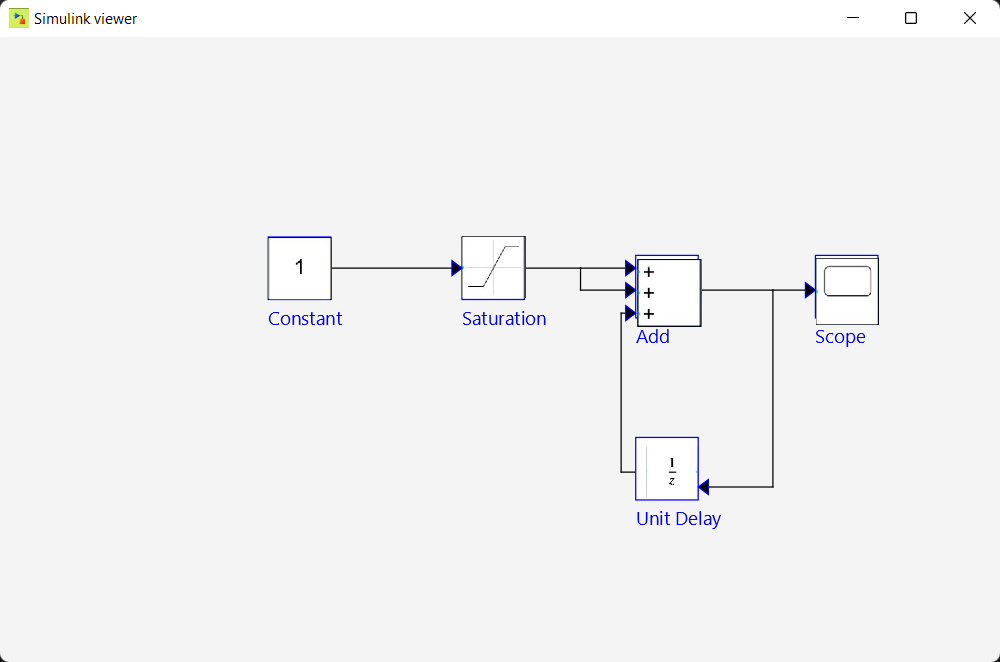

# .mdl Viewer

- This program simply takes an .mdl and view it's components by using a java GUI friendly interface.
- It's a part of the advanced programming course of ASU-Faculty of engineering computer and systems branch.
<h2>Usage</h2>
<ol>
  <li>Clone this repository</li>
  <li>Make sure to add the path to your Javafx JDK lib folder in your system environment variables and name it "PATH_TO_FX", or simply put it in the batch file insted of "%PATH_TO_FX%</li>
  <li>Build the project using the provided build script</li>
  <li>Launch the application and open a Simulink MDL file</li>
  <li>Explore the model</li>
</ol>

